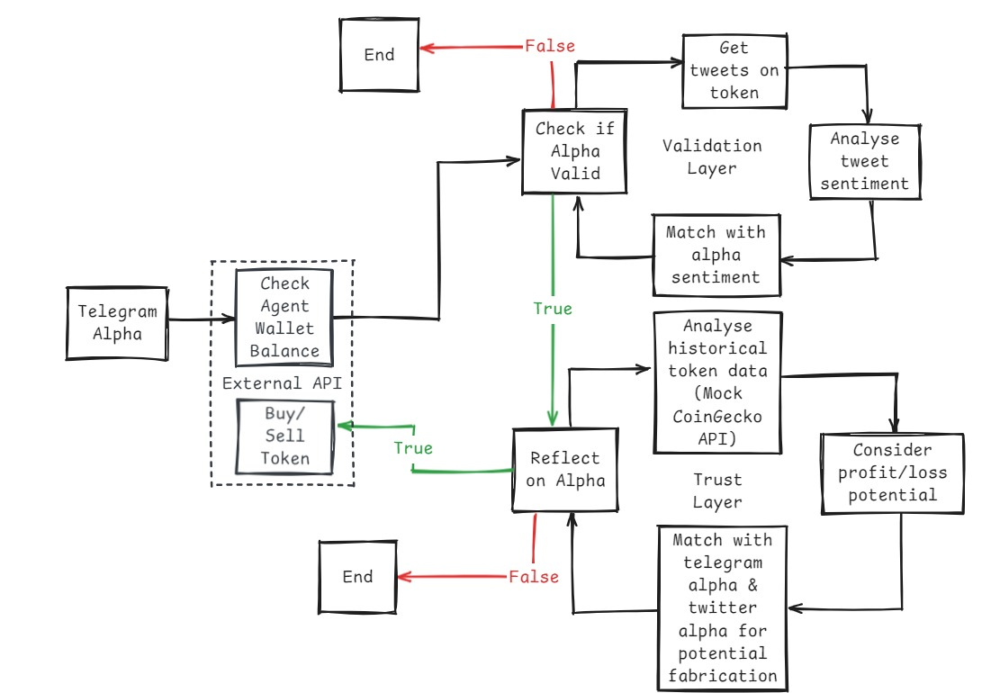

# AlphaScanAI

AlphaScanAI is a cutting-edge DeFAI (Decentralized Finance AI) agent that revolutionizes crypto trading by providing intelligent, data-driven insights and automated trading decisions. Our platform combines Telegram signal monitoring, Twitter verification, and historical data analysis to deliver reliable trading opportunities.

## 🌟 Key Features

- **Multi-Source Alpha Collection**: Aggregates trading signals from Telegram channels
- **Cross-Platform Verification**: Validates signals against Twitter activity
- **Historical Analysis**: Performs comprehensive historical data analysis
- **Deterministic Validation**: Implements trust layers backed by real data
- **Autonomous Trading**: AI-powered decision making for buy/sell operations
- **Transparent Operations**: Clear visibility into the decision-making process


*AlphaScanAI Backend System Architecture Overview*


## 🔒 Security & Trust

AlphaScanAI prioritizes security and transparency:
- Deterministic validation processes
- No reliance on synthetic data
- Clear audit trails for all decisions
- Multi-layer verification system

## 🏗️ Architecture

The project is built with a modern, scalable architecture:

### Backend (`tg-backend/`)
- Python-based Telegram signal processing
- Web3 integration for blockchain interactions
- Smart contract interaction utilities
- Signal validation and processing logic

### Frontend (`op-frontend/`)
- Next.js-based modern web application
- TypeScript for type safety
- Tailwind CSS for responsive design
- Real-time data visualization

## 🚀 Getting Started

### Prerequisites
- Node.js (v16 or higher)
- Python 3.8+
- Telegram API credentials
- Twitter API credentials
- Web3 provider access

### Installation

1. Clone the repository:
```bash
git clone https://github.com/your-org/AlphaScanAI.git
cd AlphaScanAI
```

2. Set up the backend:
```bash
cd tg-backend
pip install -r requirements.txt
cp .env.example .env
# Edit .env with your credentials
```

3. Set up the frontend:
```bash
cd op-frontend
npm install
# Configure environment variables
```

### Running the Application

1. Start the backend:
```bash
cd tg-backend
python tele.py
```

2. Start the frontend:
```bash
cd op-frontend
npm run dev
```

## 🤝 Contributing

We welcome contributions! Please read our contributing guidelines and submit pull requests.

## 📄 License

This project is licensed under the MIT License - see the LICENSE file for details.

## 📞 Support

For support, please reach out to our team or join our community channels.

## 🌐 Links

- [Website](https://alphascan.ai)
- [Twitter](https://twitter.com/AlphaScanAI)
- [Documentation](https://docs.alphascan.ai) 